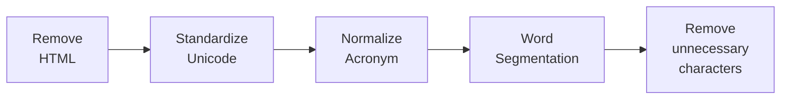

78# Aspect-based Sentiment Analysis for Vietnamese
> Multi-task Solution for Aspect Category Sentiment Analysis (ACSA) on Vietnamese Datasets
- Demo: https://youtu.be/ggmAvpA4oHQ

## Overview

We solved 2 tasks in the Vietnamese Aspect-based Sentiment Analysis problem: **Aspect Category Detection** (ACD) and **Sentiment Polarity Classification** (SPC). Besides, we proposed end-to-end models to handle the above tasks simultaneously for 1 domains (Hotel) in the [VLSP 2018 ABSA](https://vlsp.org.vn/vlsp2018/eval/sa) dataset using [PhoBERT](https://github.com/VinAIResearch/PhoBERT) as Pre-trained language models for Vietnamese in 4 ways: 
- Multi-task:

- Multi-task with Multi-branch approach:

- CNN

- Bi-LSTM

The models achieved good results when concatenating the last 4 layers of BERT together. You can download the model weights [here](https://drive.google.com/file/d/1YKnZnoehv31n3vFhs8ZDZ00ClwU0gUPI/view?usp=sharing).

## Dataset
- The VLSP 2018 Aspect-based Sentiment Analysis dataset:

|   Domain   |  Dataset | Reviews | Aspects | AvgLength | VocabSize | DiffVocab |
|:----------:|:--------:|:-------:|:-------:|:---------:|:---------:|:---------:|
|            | Training |  2,961  |  9,034  |     54    |   5,168   |     -     |
| Restaurant |    Dev   |  1,290  |  3,408  |     50    |   3,398   |   1,702   |
|            |   Test   |   500   |  2,419  |    163    |   3,375   |   1,729   |
|            | Training |  3,000  |  13,948 |     47    |   3,908   |     -     |
|    Hotel   |    Dev   |  2,000  |  7,111  |     23    |   2,745   |   1,059   |
|            |   Test   |   600   |  2,584  |     30    |   1,631   |    346    |

- Preprocessing: 

## Results
<table>
<thead>
  <tr>
    <th rowspan="2">Task</th>
    <th rowspan="2">Method</th>
    <th colspan="3">Hotel</th>
    <th colspan="3">Restaurant</th>
  </tr>
  <tr>
    <th>Precision</th>
    <th>Recall</th>
    <th>F1-score</th>
    <th>Precision</th>
    <th>Recall</th>
    <th>F1-score</th>
  </tr>
</thead>
<tbody>
  <tr>
    <td align="center" rowspan="4">Aspect Detection</td>
    <td align="center">Bi-LSTM</td>
    <td align="center">98.80</td>
    <td align="center">5.70</td>
    <td align="center">5.00</td>
    <td align="center">-</td>
    <td align="center">-</td>
    <td align="center">-</td>
  </tr>
  <tr>
    <td align="center">CNN</td>
    <td align="center">77.70</td>
    <td align="center">44.30</td>
    <td align="center">48.00</td>
    <td align="center">-</td>
    <td align="center">-</td>
    <td align="center">-</td>
  </tr>
  <tr>
    <td align="center">Multi-task</td>
    <td align="center">82.70</td>
    <td align="center">50.00</td>
    <td align="center">55.00</td>
    <td align="center">-</td>
    <td align="center">-</td>
    <td align="center">-</td>
  </tr>
  <tr>
    <td align="center">Multi-task Multi-branch</td>
    <td align="center">95.20</td>
    <td align="center">47.70</td>
    <td align="center">52.30</td>
    <td align="center">-</td>
    <td align="center">-</td>
    <td align="center">-</td>
  </tr>
  <tr>
    <td align="center" rowspan="4">Aspect + Polarity</td>
    <td align="center">Bi-LSTM</td>
    <td align="center">96.70</td>
    <td align="center">28.10</td>
    <td align="center">26.20</td>
    <td align="center">-</td>
    <td align="center">-</td>
    <td align="center">-</td>
  </tr>
  <tr>
    <td align="center">CNN</td>
    <td align="center">78.80</td>
    <td align="center">45.80</td>
    <td align="center">46.60</td>
    <td align="center">-</td>
    <td align="center">-</td>
    <td align="center">-</td>
  </tr>
  <tr>
    <td align="center">Multi-task</td>
    <td align="center">82.30</td>
    <td align="center">50.09</td>
    <td align="center">52.20</td>
    <td align="center">-</td>
    <td align="center">-</td>
    <td align="center">-</td>
  </tr>
  <tr>
    <td align="center">Multi-task Multi-branch</td>
    <td align="center">82.20</td>
    <td align="center">48.70</td>
    <td align="center">50.10</td>
    <td align="center">-</td>
    <td align="center">-</td>
    <td align="center">-</td>
  </tr>
</tbody>
</table>
